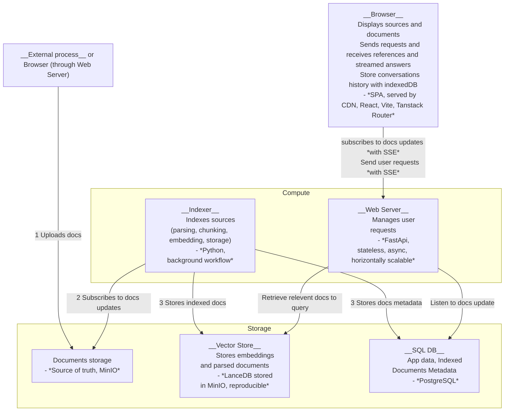
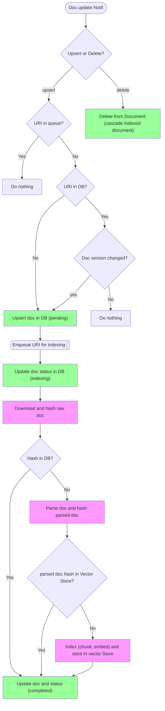

# Software Architecture

## Services Architecture

Architecture goals:

- Easy to self-host (on a small CPU server with a simple docker-compose)
- Uncoupled from a specific vector store (separated from App DB)
- Scale horizontally (in compute and storage)
- Support Blue-Green Deployment (zero downtime)
- Compatible with authentication, encryption, RBAC and multi-tenancy

## Indexing Process

Indexing process goals:

- Minimize costly operations
- Notify users in real time

