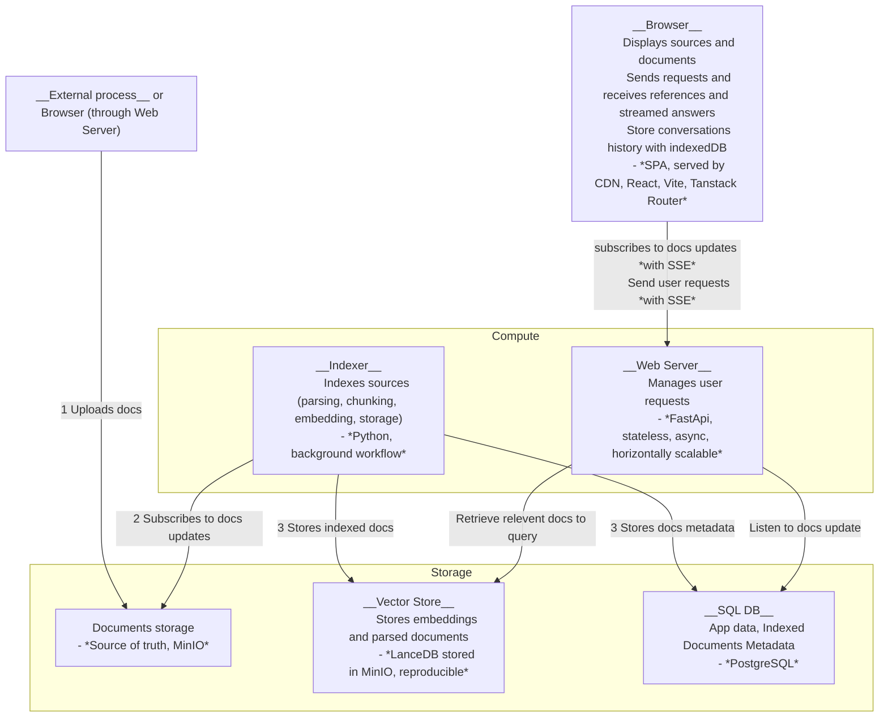
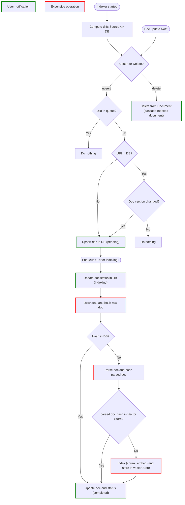

# Software Architecture

## Services Architecture

Architecture goals:

- Easy to self-host (on a CPU server using docker-compose)
- Horizontally scalable (both in compute and storage)
- Support blue-green Deployment (zero downtime)
- Extensible with authentication, encryption, RBAC and multi-tenancy
- Extensible to other document sources
- Extensible to other vector stores

## Indexing Process

Indexing process goals:

- Resynchronize with the source on cold start or after a process stop
- Minimize expensive operations
- Notify users in real time
- Ensure state remains consistent in case of an error during the indexing process

### How is zero-downtime upgrade managed ?

The key of an indexed document in db and vector store is a pair (uri,indexer-version). Therefore several indexer versions can run concurrently. Once the indexing for a new version is completed, the frontend can switch to the new version.

### how indexing failures are managed ?

We use eventual consistency from the point from the point of view od the internal system, but it's strongly consistent from the user point of view:

* SQL db act as source of truth
* Vector store upserts are idempotent

__On upsert__:
1. We check in the sql db if indexing is required
1. We update the vector store
2. We update the db

__On delete__:
1. We delete from the db
2. We delete from the vector store

This ensures that when a document is marked as successfully indexed in the SQL database, it is always present in the vector store.

__On retrieval__:
1. We select from the vector store
2. We only keep documents present in the sql databse

This ensures that "hanging" documents (not yet deleted or not completly inserted) in the vector store do not impact the actual result.